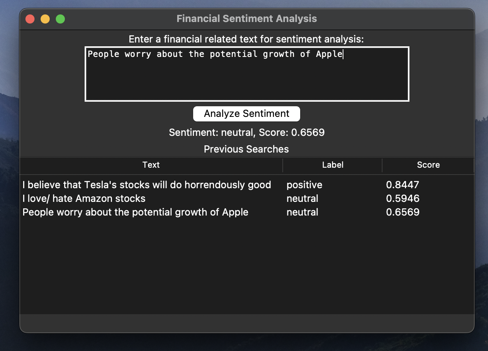

# Financial Sentiment Analysis

This project demonstrates a simple financial sentiment analysis tool using Python and the Transformers library. It provides a user-friendly graphical interface to analyze the sentiment of financial-related text.

## Table of Contents

### Introduction
Financial sentiment analysis is the process of determining the sentiment or emotional tone of financial news articles, tweets, or other text data. It can help traders, investors, and financial analysts gauge market sentiment and make more informed decisions.

This project utilizes the transformers library to leverage the "ProsusAI/finbert" model, which is pretrained for financial sentiment analysis. It creates a simple graphical user interface (GUI) using the tkinter library to input financial-related text and obtain sentiment analysis results.

### Installation

Before running the application, ensure you have the required libraries installed. You can install them using pip:

```python
pip install transformers
pip install datasets
```
### Usage

1. Run the application by executing the provided Python script:

```python
python NLP_finbertApp.py
```
2. The GUI window will open, allowing you to perform sentiment analysis on financial text.

#### Initial user input


3. Enter financial-related text in the input field.

4. Click the "Analyze Sentiment" button to perform sentiment analysis.
  
5. The sentiment analysis result (label and score) will be displayed below the input field.

#### Model output

  
6. Previous searches and their results will be logged in the table in the "Previous Searches" section.
  
7. You can analyze the sentiment of multiple texts and review their results in the log.


